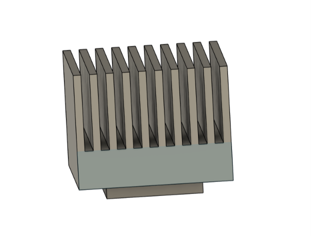
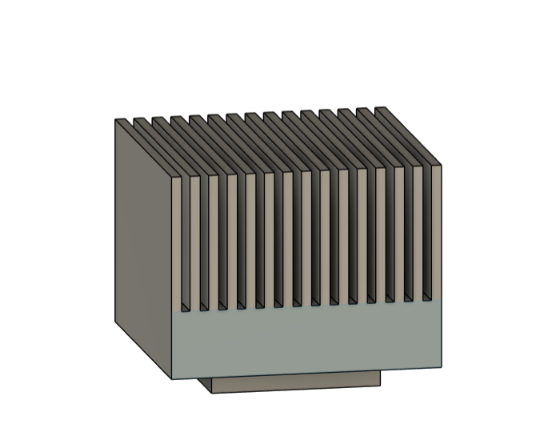
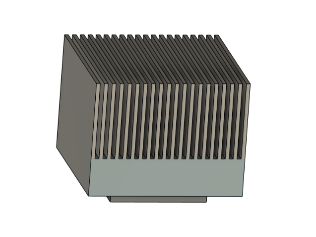
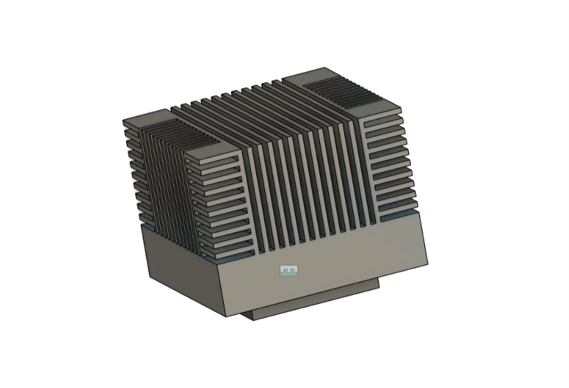

# Heat Sink Design & Thermal Performance Evaluation

## Overview

This project focuses on the **design and thermal performance evaluation of different heat sink configurations for cooling an IC chip**.

Four heat sink configurations were designed with different fin arrangements to investigate the effect of fin configuration on heat dissipation and cooling performance.

The designed configurations are:

- **10-Fin Heat Sink**
- **15-Fin Heat Sink**
- **20-Fin Heat Sink**
- **Multi-Fin Heat Sink**

The main objective is to determine which heat sink configuration provides effective cooling and can maintain the IC chip temperature **below 70°C**.

---

## Design Specifications

All dimensions are in **mm**.

| Parameter | Dimension |
|---|---:|
| Base Plate Length | 40 mm |
| Base Plate Width | 40 mm |
| Base Plate Thickness | 10 mm |
| Fin Length | 20 mm |
| IC Chip Length | 25 mm |
| IC Chip Width | 25 mm |
| IC Chip Thickness | 4 mm |

The same base plate and fin length are used for the different configurations to provide a consistent basis for comparison.

---

## Heat Sink Configurations

### 10-Fin Heat Sink

A heat sink consisting of **10 fins** mounted on a 40 × 40 mm base plate.

### 15-Fin Heat Sink

A heat sink consisting of **15 fins** mounted on the same base plate dimensions.

### 20-Fin Heat Sink

A heat sink consisting of **20 fins** mounted on the same base plate dimensions.

### Multi-Fin Heat Sink

A multi-fin heat sink configuration designed to investigate the effect of increased fin density and fin arrangement on heat dissipation.

---

## Design Objective

The objective is to investigate how the **number and arrangement of fins** affect the thermal performance of the heat sink.

The designs will be evaluated based on their ability to dissipate heat from the IC chip while maintaining the chip temperature below the target limit of **70°C**.

---

## Current Progress

The **CAD design of all four heat sink configurations has been completed**.

### Completed

- [x] 10-fin heat sink design
- [x] 15-fin heat sink design
- [x] 20-fin heat sink design
- [x] Multi-fin heat sink design
- [x] IC chip geometry
- [x] Base plate geometry

---

## Future Progress – ANSYS Fluent Analysis

The next stage of the project will involve performing **CFD and thermal analysis using ANSYS Fluent**.

The simulations will be used to evaluate and compare the thermal performance of all four heat sink configurations.

The analysis will investigate:

- IC chip temperature
- Heat transfer from the IC chip
- Temperature distribution across the heat sink
- Airflow around the fins
- Heat dissipation rate
- Effect of fin count and arrangement
- Thermal performance of each configuration

The simulation results will be compared to determine which configuration provides effective cooling while maintaining the IC chip temperature **below 70°C**.

---

## Performance Evaluation

The four configurations will be compared using the results obtained from ANSYS Fluent.

The performance evaluation will consider parameters such as:

| Parameter | Purpose |
|---|---|
| Maximum IC Temperature | Check whether the temperature remains below 70°C |
| Temperature Distribution | Evaluate heat spreading through the heat sink |
| Heat Transfer Rate | Determine heat dissipation capability |
| Airflow | Evaluate flow behavior around the fins |
| Fin Configuration | Compare the effect of different fin arrangements |

The final comparison will be based on the **simulation results**, rather than assuming that a higher number of fins automatically provides better cooling.

---

## Software Used

- **Autodesk Fusion 360** – Heat sink and IC chip CAD modeling
- **ANSYS Fluent** – CFD and thermal analysis

---

## Skills Demonstrated

- Parametric CAD modeling
- Heat sink design
- Thermal management concepts
- Mechanical design
- Design comparison
- CFD simulation
- Thermal analysis
- ANSYS Fluent
- Engineering performance evaluation

---

## Project Status

**🚧 CAD Design Completed | ANSYS Fluent Analysis Pending**
